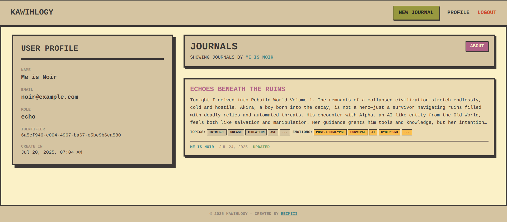

# Kawihlogy

A minimalist journaling web application designed for clarity, expression, and thematic exploration. Inspired by Gruvbox aesthetics and UNIX minimalism, the UI emphasizes typography, contrast, and semantic clarity. No distractions. Just journaling.

## Demo
[](./f.mp4)
<video width="640" height="360" controls>
  <source src="./f.mp4" type="video/mp4">
</video>

## Core Features

- **Journaling:** Create, view, and edit personal journal entries.
- **Tagging:** Tag entries with **topics** and **emotions** for better organization.
- **AI Integration:** Generate poems from your journal entries and listen to audio generated from those poems.
- **Privacy Control:** Toggle journal entries between public and private.
- **Community:** Browse other users' public journals.
- **User Profiles:** Manage your user profile information.
- **Real-time Updates:** Utilizes Socket.IO for real-time communication.

## Tech Stack

- **Frontend:**
  - [React](https://react.dev/) + [Vite](https://vitejs.dev/)
  - [TypeScript](https://www.typescriptlang.org/)
  - [Tailwind CSS](https://tailwindcss.com/)
  - [React Router](https://reactrouter.com/) for routing.
  - [TanStack Query](https://tanstack.com/query/latest) for data fetching and state management.
  - [Axios](https://axios-http.com/) for HTTP requests.
  - [Socket.IO Client](https://socket.io/docs/v4/client-api/) for real-time communication.
- **Backend:**
  - [NestJS](https://nestjs.com/)

## Getting Started

To get a local copy up and running, follow these simple steps.

### Prerequisites

- [Node.js](https://nodejs.org/en/) (v18.x or higher)
- [npm](https://www.npmjs.com/)

### Installation

1. Clone the frontend repository:
   ```sh
   git clone https://github.com/reimiii/kawihlogy-ui.git
   ```
2. Install NPM packages:
   ```sh
   npm install
   ```
3. Create a `.env` file in the root of the project and add the necessary environment variables for the backend API.
4. Start the development server:
   ```sh
   npm run dev
   ```

## Available Scripts

In the project directory, you can run:

- `npm run dev`: Runs the app in the development mode.
- `npm run build`: Builds the app for production.
- `npm run lint`: Lints the codebase.
- `npm run preview`: Serves the production build locally.

## Open Source & Contact

Kawihlogy is an open-source project. You can explore the source code, report issues, or contribute via GitHub. For feedback or inquiries, feel free to reach out.

- **Frontend:** [https://github.com/reimiii/kawihlogy-ui](https://github.com/reimiii/kawihlogy-ui)
- **Backend:** [https://github.com/reimiii/kawihlogy](https://github.com/reimiii/kawihlogy)
- **Contact:** [imiia75775@gmail.com](mailto:imiia75775@gmai.com)
- **LinkedIn:** [Hilmi Akbar Muharrom](https://www.linkedin.com/in/hilmi-akbar-muharrom/)
